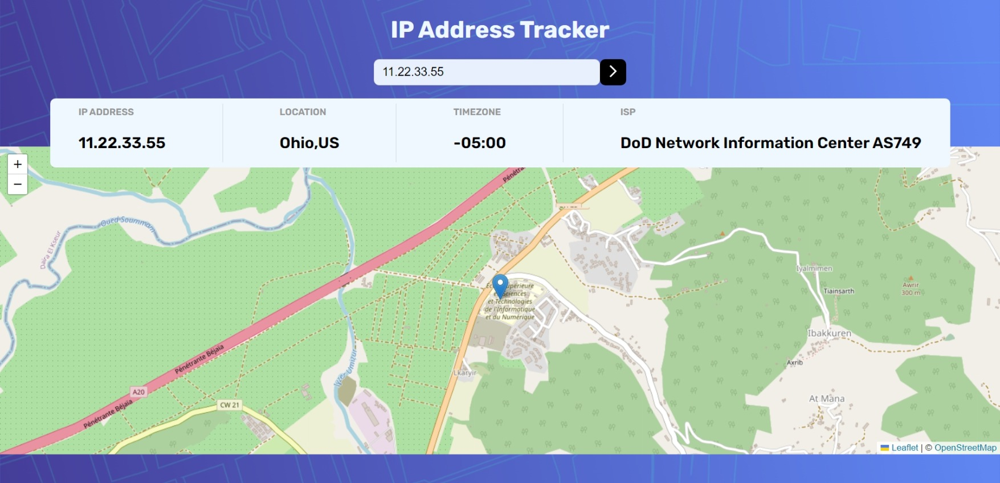

<<<<<<< HEAD
# React + Vite

This template provides a minimal setup to get React working in Vite with HMR and some ESLint rules.

Currently, two official plugins are available:

- [@vitejs/plugin-react](https://github.com/vitejs/vite-plugin-react/blob/main/packages/plugin-react/README.md) uses [Babel](https://babeljs.io/) for Fast Refresh
- [@vitejs/plugin-react-swc](https://github.com/vitejs/vite-plugin-react-swc) uses [SWC](https://swc.rs/) for Fast Refresh
=======
# overview
Users should be able to:

View the optimal layout for each page depending on their device's screen size
See hover states for all interactive elements on the page
See their own IP address on the map on the initial page load
Search for any IP addresses or domains and see the key information and location

# screenshot

# My process
 ### Built with
 - Semantic HTML5 markup
 - CSS custom properties
 - Flexbox
 - - [React](https://reactjs.org/) - JS library
 - - [https://styled-components.com/](https://mui.com/material-ui/getting-started/) - For styles
 - - [anime.js] - JS library - For animation

# what i learned
 this was the first time using a map library, learned how to integrate and manipulate maps, add markers using the [leaflet.js](https://leafletjs.com/index.html)

# contined development
for the moment, the api used in this project does not provide location coordinates for the ip address or domain searched for, this leaves me without data to input to my map component, so i had to statically configure the map to point to my school, still didn't make the map responsive to small screen , so it will be covered by the result elemeny
   ### useful resources

- [uiverse](https://uiverse.io/) - for animated elements

  ## Author
- Instagram  -[@taha_belaloui](https://www.instagram.com/taha_belaloui) 
    
>>>>>>> abd6391be7399fb3711e42a7558364800cdd2d12
